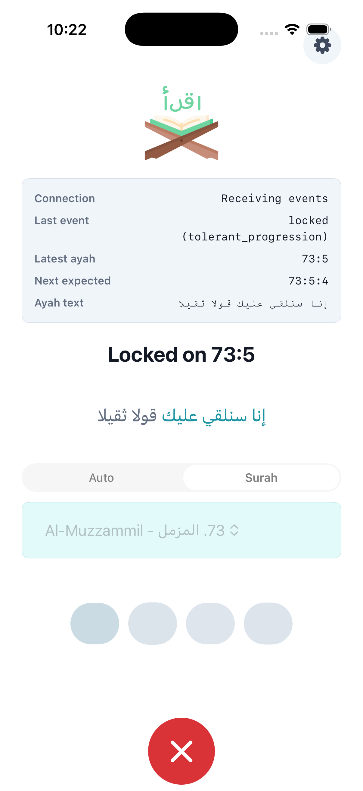
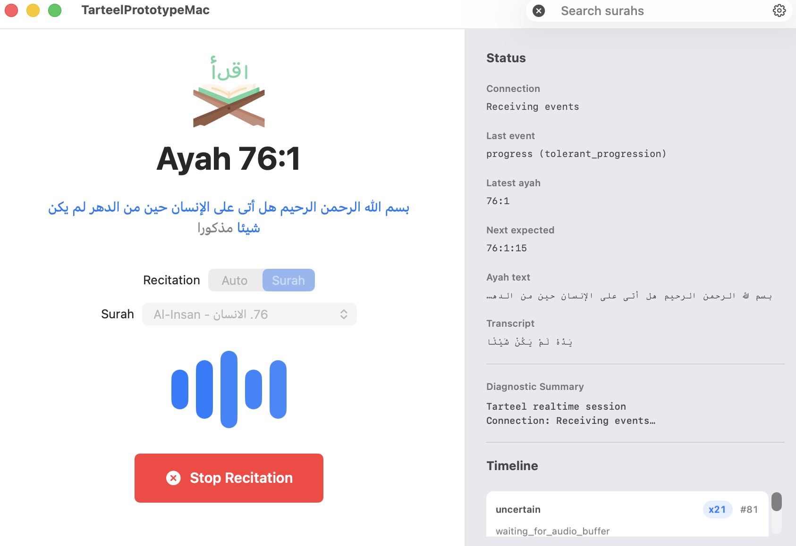

# Tarteel Realtime

Build a Tarteel-like native Apple recitation app: listen to Quran recitation,
locate the current ayah, show canonical Quran text, track word progress, and
surface obvious text-level mistakes or uncertainty.

This repo contains the iOS app, macOS app, shared Swift client core, and the
Python/Modal support needed to test local and remote ASR modes.

## Screenshots





## Tech Stack

- **iOS app**: SwiftUI target in `ios/TarteelPrototype`.
- **macOS app**: native SwiftUI/AppKit-friendly target in
  `ios/TarteelPrototype`.
- **Shared Apple core**: `ios/TarteelClientCore` handles endpoint presets,
  recording orchestration, state reduction, event decoding, CoreML routing, and
  tests.
- **Backend support**: Python FastAPI/WebSocket backend for deterministic
  simulator testing and Modal deployment for real remote ASR.

## ASR Modes

- **CoreML**: local in-app FastConformer route at
  `coreml://fastconformer-quran-streaming`. Fresh installs default to CoreML
  with selected Surah 108. Use physical iPhone hardware for real iOS CoreML ASR
  evidence; the iOS Simulator can build/render the app but is not valid ASR
  proof for this ANE-specialized model.
- **Simulator**: local fake backend at
  `ws://127.0.0.1:8000/ws/recitation`. Use this for predictable UI and state
  testing without real ASR.
- **Custom / Modal**: remote WebSocket backend at
  `wss://<modal-app>.modal.run/ws/recitation`. The app sends the selected Surah
  as `scope=<surah-id>` and the selected model as `asr_model=<slug>`.

Approved Modal ASR slugs:

```text
nemo-fastconformer-quran-ar
faster-whisper-base-ar-quran
```

## User Journey

1. Open the iOS or macOS app.
2. Choose the Surah you want to recite.
3. Pick an ASR mode in Settings: `CoreML`, `Simulator`, or `Custom`.
4. If using Modal, paste the WSS URL and bearer token in Settings, then choose
   the ASR model.
5. Start recording.
6. Recite from the beginning or from the middle of the selected Surah.
7. Watch the app move through listening, locating, locked, progress, correction
   needed, or uncertain states.
8. Read canonical Quran text from the local corpus, not noisy ASR transcript
   text.

## App Features

### iOS

- Recitation-first screen with status, latest ayah, next expected position,
  canonical ayah text, voice indicator, Surah picker, and mic control.
- Settings sheet for backend mode, Custom Modal URL, bearer token, and Modal ASR
  model.
- Memory-only bearer token entry on iPhone.
- Actionable setup errors for missing local backend, Modal auth rejection, and
  invalid CoreML Simulator output.

### macOS

- Native desktop recitation window with toolbar recording, Surah search, and
  Settings.
- Keyboard shortcuts: `Space` or `Command-R` toggles recording;
  `Command-F` focuses Surah search.
- Status sidebar with latest ayah, next expected position, ayah text,
  transcript, diagnostic summary, and timeline.
- Custom Modal bearer tokens are stored in macOS Keychain after entry.

## Install And Run

Prerequisites:

- macOS with Xcode installed.
- `uv` for Python commands.
- Modal CLI configured only if you want remote Modal ASR.
- Optional CoreML model artifacts at
  `.models/fastconformer-quran-coreml-streaming/`.
- Optional full Tanzil text at `data/tanzil/quran-simple-clean.txt`.

Clone and open the project:

```bash
git clone https://github.com/moabdelmoez/tarteel-realtime.git
cd tarteel-realtime
open ios/TarteelPrototype/TarteelPrototype.xcodeproj
```

### iOS Simulator

In Xcode:

1. Select the `TarteelPrototypeCoreMLReplay` scheme.
2. Choose an iPhone Simulator.
3. Build and run.

Command-line build:

```bash
xcodebuild -project ios/TarteelPrototype/TarteelPrototype.xcodeproj -scheme TarteelPrototypeCoreMLReplay -sdk iphonesimulator -destination 'generic/platform=iOS Simulator' -derivedDataPath /private/tmp/tarteel-xcode-derived CODE_SIGNING_ALLOWED=NO build
```

For deterministic simulator backend testing, run the local fake backend and set
the app backend to `Simulator`:

```bash
uv run uvicorn tarteel_realtime.dev_app:app --reload
```

Health check:

```bash
curl http://127.0.0.1:8000/health
```

### macOS App

In Xcode:

1. Select the `TarteelPrototypeMac` scheme.
2. Build and run.

Command-line build:

```bash
xcodebuild -project ios/TarteelPrototype/TarteelPrototype.xcodeproj -scheme TarteelPrototypeMac -sdk macosx -derivedDataPath /private/tmp/tarteel-xcode-derived-macos CODE_SIGNING_ALLOWED=NO build
```

Open the built app:

```bash
open -n /private/tmp/tarteel-xcode-derived-macos/Build/Products/Debug/TarteelPrototypeMac.app
```

## Modal Token And Remote ASR

There are two different tokens:

- **Modal account token**: lets your machine deploy and manage Modal apps. Set it
  up with `modal setup` or `modal token new`.
- **App bearer token**: protects this prototype's
  `wss://.../ws/recitation` endpoint. This is the token you paste into the iOS
  or macOS app Settings.

Create the app bearer secret in Modal:

```bash
modal secret create tarteel-modal-asr-secrets TARTEEL_WS_BEARER_TOKEN="<prototype-token>"
```

Prewarm the model volume and deploy:

```bash
modal run deploy/modal_asr_app.py::prewarm
modal deploy deploy/modal_asr_app.py
```

After deploy:

1. Copy the deployed Web Function URL.
2. Convert it to WebSocket form:
   `https://<modal-app>.modal.run` ->
   `wss://<modal-app>.modal.run/ws/recitation`.
3. In the Apple app, open Settings.
4. Choose `Custom` / `Modal`.
5. Paste the WSS URL and app bearer token.
6. Choose `FastConformer Quran AR (NeMo)` or
   `Faster Whisper Base AR Quran`.
7. Select a Surah and record.

For deeper Modal replay and comparison workflows, see
`docs/modal-serverless.md`.

## Notes

- Remote backends use only WebSocket `/ws/recitation`.
- The local CoreML route is in-app only; it is not a second remote backend
  transport.
- The visible app flow is selected-Surah first. Choose a Surah before
  recording.
- Keep bearer tokens, local Quran text, raw recitation audio, and generated
  diagnostics out of git.
- Heavy ASR dependencies remain opt-in and should not become default test
  dependencies.
- This MVP is text-level location and correction, not tajweed scoring,
  phoneme-level feedback, or production memorization coaching.

## Verification

Docs and project sanity:

```bash
git diff --check
xcodebuild -list -project ios/TarteelPrototype/TarteelPrototype.xcodeproj
```

Python baseline:

```bash
uv run python -B -m unittest discover -s tests -v
uv run python -m compileall -q tarteel_realtime tests
```

Swift client core:

```bash
cd ios/TarteelClientCore
env CLANG_MODULE_CACHE_PATH=/private/tmp/tarteel-clang-module-cache SWIFT_MODULE_CACHE_PATH=/private/tmp/tarteel-swift-module-cache swift test
```
